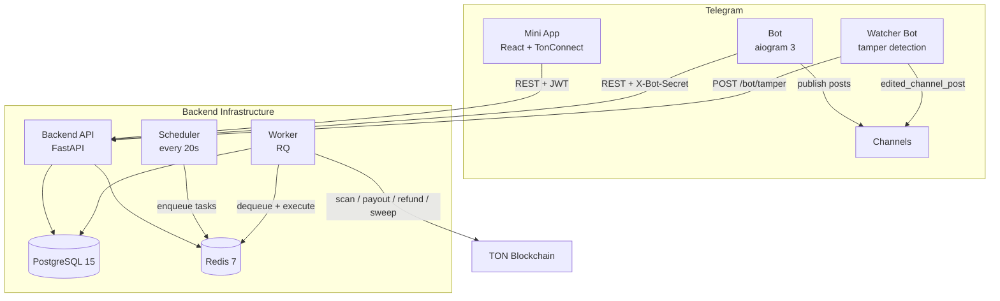
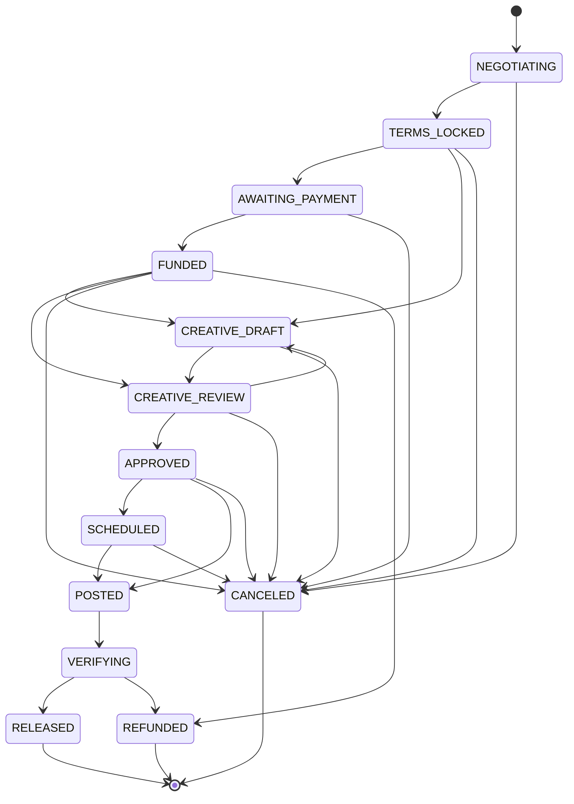

# Telegram Ads Marketplace

**Demo bot:** [@build_contest_ads_bot](https://t.me/build_contest_ads_bot) (needs to be made admin of the channel where ads will be published)

**Watcher bot:** [@build_contest_ads_watcher_bot](https://t.me/build_contest_ads_watcher_bot) (must also be added as channel admin)

A fully functional two-sided marketplace for Telegram channel advertising, built as a **Telegram Mini App + Bot** with on-chain **TON escrow**, automated post publishing, verified channel statistics, and tamper/deletion detection.

**Key capabilities:**
- Two entry points: channel owners list ad slots, advertisers post requests
- Negotiations and deal workflow run entirely through the Telegram bot
- Per-deal TON escrow wallets with AES-GCM encrypted keys
- Automated post scheduling, publishing, and delivery verification
- Verified channel statistics via MTProto (`stats.getBroadcastStats`) with Bot API fallback
- Tamper and deletion detection via a dedicated watcher bot
- TonConnect-powered payments in the Mini App

## Demo

<video src="demo/demo-miniapp.mp4" controls width="720"></video>

## Table of Contents

- [Demo](#demo)
- [Architecture](#architecture)
- [Tech Stack](#tech-stack)
- [Contest Requirements Coverage](#contest-requirements-coverage)
- [Deal Lifecycle](#deal-lifecycle)
- [Design Decisions](#design-decisions)
- [Quick Start (Docker)](#quick-start-docker)
- [Development Setup](#development-setup)
- [Project Structure](#project-structure)
- [Documentation](#documentation)
- [Known Limitations](#known-limitations)
- [Future Work](#future-work)

## Architecture



**8 services** orchestrated via Docker Compose: Caddy (reverse proxy), PostgreSQL, Redis, Backend API, Worker, Scheduler, Bot, and Watcher Bot.

## Tech Stack

| Layer | Technology | Version |
|---|---|---|
| Backend API | FastAPI + Pydantic v2 | 0.111 |
| ORM | SQLAlchemy 2 (mapped_column) | 2.0 |
| Migrations | Alembic | 1.13 |
| Task Queue | Redis + RQ | Redis 7 |
| Telegram Bot | aiogram 3 | 3.24 |
| MTProto Stats | Telethon | 1.36 |
| TON Blockchain | tonsdk + pytoniq | — |
| Encryption | cryptography (AES-GCM) | — |
| JWT | python-jose | — |
| Rate Limiting | slowapi + Redis | — |
| Mini App | React 18 + TypeScript | 18.3 |
| Build Tool | Vite | 5.4 |
| UI Kit | @telegram-tools/ui-kit | 0.2.4 |
| Payments | @tonconnect/ui-react | 2.4 |
| Styling | Tailwind CSS | 3.4 |
| Reverse Proxy | Caddy 2 (auto HTTPS) | 2 |
| Database | PostgreSQL | 15 |

## Contest Requirements Coverage

### A. Two-Sided Marketplace

| Requirement | Status | Implementation |
|---|---|---|
| Channel owner listings | Done | Backend API + Bot `/create_listing` + Mini App |
| Advertiser requests | Done | Backend API + Bot `/create_request` + Mini App |
| PR managers | Done | Bot `/add_manager`, `/list_managers`, `/remove_manager` + Mini App UI |
| Unified workflow (both entries converge) | Done | `Deal` model + bot `deals.py` — same flow regardless of entry point |
| Negotiations via bot (not in-app chat) | Done | Bot FSM + inline buttons + deal messaging (`DealEvent type=MESSAGE`) |

### B. Verified Channel Statistics

| Requirement | Status | Implementation |
|---|---|---|
| Subscribers | Done | `stats_service.py` — Bot API fallback |
| Average views / reach | Done | `stats_service.py` — MTProto `getBroadcastStats` |
| Language distribution | Done | `stats_service.py` — MTProto `languages_json` |
| Telegram Premium stats | Done | `stats_service.py` — MTProto `premium_json` |
| Graceful degradation | Done | `fetch_bot_api_subscribers()` when MTProto unavailable, `source` field for transparency |

### C. Ad Formats and Pricing

| Requirement | Status | Implementation |
|---|---|---|
| Price per format | Done | `Listing.format` (free-text, default `post`) |
| Dual currency | Done | `Listing.price_ton` + `Listing.price_usd` |

### D. Escrow Deal Lifecycle

| Requirement | Status | Implementation |
|---|---|---|
| Advertiser payment | Done | `escrow_service.create_deposit` + `ton_escrow.create_deposit_wallet` |
| Fund holding | Done | Custodial: unique v4r2 wallet per deal |
| Auto-cancel / timeout | Done | `check_payment_timeouts` background task (24h default) |
| Release (payout to owner) | Done | `escrow_service.release_payment` + `ton_escrow.send_payout` |
| Refund (return to advertiser) | Done | `escrow_service.refund_payment` + `ton_escrow.send_refund` |
| Unique deposit address per deal | Done | `create_deposit_wallet` generates a new v4r2 wallet |
| Key encryption | Done | AES-GCM via `ESCROW_SECRET_KEY` |
| Sweep leftover funds | Done | `sweep_completed_deposits` returns reserve to advertiser |

### E. Creative Approval + Auto-Posting + Verification

| Requirement | Status | Implementation |
|---|---|---|
| Creative upload (text + media) | Done | Bot `/creative` + `Creative` model with versioning |
| Review / approve / request changes | Done | Bot `/creative_status` + FSM |
| Negotiations on creative | Done | Deal messaging (text/media between parties via bot) |
| Scheduled auto-posting | Done | `process_scheduled_posts` background task |
| Tamper detection (edits) | Done | Watcher bot catches `edited_channel_post` |
| Deletion detection | Done | `check_deleted_posts` via `copyMessage` to log chat |
| Verification window -> release/refund | Done | `check_verification_windows` background task |

## Deal Lifecycle

13 statuses with strictly enforced transitions (`InvalidTransitionError` on invalid moves):



**Terminal states:** `RELEASED` (owner paid), `REFUNDED` (advertiser reimbursed), `CANCELED`.

**Role permissions:**
| Role | Can transition to |
|---|---|
| Owner (channel owner / manager) | TERMS_LOCKED, CANCELED, SCHEDULED, POSTED, VERIFYING, RELEASED, REFUNDED |
| Advertiser | AWAITING_PAYMENT, FUNDED, CANCELED |

**Automated transitions** (background tasks): AWAITING_PAYMENT -> CANCELED (timeout), APPROVED/SCHEDULED -> POSTED (auto-publish), POSTED -> VERIFYING, VERIFYING -> RELEASED/REFUNDED (verification window).

## Design Decisions

### Bot as the Communication Layer

The Mini App serves as a **storefront**: browsing listings/requests, viewing channel stats, TonConnect payment, and deal overview. The Bot handles all **workflow and negotiations**: locking terms, creative review, status transitions, deal messaging between parties, and notifications.

This architecture directly satisfies the contest requirement that negotiations happen through the bot, not via an in-app chat. Both sides can send free-form messages (text + media) through the bot, which are stored as `DealEvent(type="MESSAGE")` and forwarded to the counterparty with quick-action buttons.

### Verified Channel Statistics

Statistics are fetched via **MTProto** `stats.getBroadcastStats` (Telethon), providing subscribers, average views per post, language distribution, and Telegram Premium percentage. When MTProto is unavailable (no Telethon session configured), the system falls back to **Bot API** `getChatMemberCount` for subscriber count only.

Each stats record includes a `source` field (`mtproto` or `bot_api`) so users and judges can see which data source was used. Views fallback: if `getBroadcastStats` returns 0 views (no posts in the stat period), the system computes the average from the last 20 channel posts.

### Delivery Verification

Post publishing is handled by a **scheduler -> worker -> Bot API** pipeline. After publishing, the system verifies delivery through two mechanisms:

1. **Tamper detection**: A dedicated **watcher bot** (separate Telegram bot added as channel admin) receives `edited_channel_post` updates. The main bot cannot detect edits to its own messages — this is a documented Telegram Bot API limitation.
2. **Deletion detection**: A periodic background task attempts to `copyMessage` to a log chat. If the copy fails, the post is marked as deleted.

After the configurable `verification_window` expires: if the post is intact, funds are released to the channel owner; if tampered or deleted, funds are refunded to the advertiser.

### Escrow Security Model

Each deal gets a **unique TON wallet** (v4r2) so deposit addresses are isolated. The wallet mnemonic is encrypted with **AES-GCM** using `ESCROW_SECRET_KEY` before storage. Decryption failures raise `ValueError` immediately (no silent fallback).

Financial operations (`confirm_payment`, `release_payment`, `refund_payment`, `sweep_deposit`) use **pessimistic locking** (`SELECT ... FOR UPDATE`) to prevent double-spend race conditions. All secret comparisons use `hmac.compare_digest` (constant-time). Escrow endpoints are **rate-limited** via slowapi + Redis. Every state change is logged as a `DealEvent` for a complete audit trail. After release/refund, a sweep task returns the leftover reserve (gas fees) to the advertiser.

## Quick Start (Docker)

**Prerequisites:** Docker and Docker Compose.

```bash
git clone <repo-url> && cd contest-build

# Configure environment
cp .env.example .env
# Edit .env: set BOT_TOKEN, WATCHER_BOT_TOKEN, JWT_SECRET, BOT_SECRET,
#            ESCROW_SECRET_KEY, TON_API_KEY, TON_HOT_WALLET

# Start all 8 services
docker compose up --build
```

**Endpoints:**
- API: `http://localhost:8000`
- API docs: `http://localhost:8000/docs`
- Health check: `http://localhost:8000/health`

## Development Setup

**Requirements:** Python 3.11+, Node.js 18+, PostgreSQL, Redis.

```bash
# 1. Configure environment
cp .env.example .env

# 2. Install Python dependencies
pip install -r requirements.txt

# 3. Start databases
docker compose up -d postgres redis

# 4. Run migrations
cd backend && alembic upgrade head && cd ..

# 5. Start services (each in a separate terminal)
uvicorn backend.app.main:app --reload          # API
python -m bot.app.main                          # Bot
python -m watcher.app.main                      # Watcher Bot
python -m backend.worker                        # Worker
python backend/worker/scheduler.py              # Scheduler

# 6. Start Mini App
cd miniapp && npm install && npm run dev        # http://localhost:5173
```

**Mini App env:** `VITE_API_BASE` (API URL), `VITE_BOT_URL` (bot deep link).

## Project Structure

```
contest-build/
├── backend/                    # FastAPI REST API
│   ├── alembic/                #   Database migrations (0001–0006)
│   ├── app/
│   │   ├── api/routes/         #   Route handlers (auth, deals, escrow, listings, ...)
│   │   ├── core/               #   Config, security (JWT, HMAC), rate limiting
│   │   ├── db/                 #   SQLAlchemy session and base
│   │   ├── models/             #   ORM models (User, Channel, Deal, EscrowPayment, ...)
│   │   ├── schemas/            #   Pydantic request/response schemas
│   │   ├── services/           #   Business logic (deal_actions, escrow, stats, TON)
│   │   └── tasks/              #   Background tasks (timeouts, scanning, posting, verification)
│   ├── worker/                 #   RQ worker + scheduler
│   └── tests/                  #   Unit and integration tests
├── bot/                        # Telegram bot (aiogram 3)
│   └── app/
│       ├── handlers/           #   Commands: start, onboarding, marketplace, deals
│       ├── keyboards/          #   Inline calendar for date/time picking
│       └── services/           #   Async HTTP client to backend API (httpx)
├── watcher/                    # Watcher bot for tamper detection
│   └── app/                    #   Handlers for edited_channel_post
├── miniapp/                    # React Telegram Mini App (Vite + TypeScript)
│   └── src/
│       ├── api/                #   API client with JWT auth
│       ├── components/         #   UI components (DealEventTimeline, ErrorBoundary, ...)
│       ├── contexts/           #   Auth context
│       ├── hooks/              #   useApi, useTonConnect, ...
│       ├── pages/              #   Listings, Requests, Deals, Channels, Payment, ...
│       └── types/              #   TypeScript type definitions
├── docs/                       # Documentation (RU/ and EN/)
├── docker-compose.yml          # All 8 services
├── Dockerfile                  # Python services (backend, bot, watcher, worker, scheduler)
├── requirements.txt            # Python dependencies
├── .env.example                # Environment variables template
└── CHANGELOG.md                # Development history
```

## Documentation

Documentation is available in [docs/](docs/) in Russian (RU) and English (EN):

| Document | Description |
|---|---|
| [docs/RU/backend.md](docs/RU/backend.md) / [docs/EN/backend.md](docs/EN/backend.md) | API endpoints, data models, services, escrow flow, background tasks, security |
| [docs/RU/bot.md](docs/RU/bot.md) / [docs/EN/bot.md](docs/EN/bot.md) | Bot commands, FSM states, callback schemes, inline calendar, API client |
| [docs/RU/watcher.md](docs/RU/watcher.md) / [docs/EN/watcher.md](docs/EN/watcher.md) | Watcher bot architecture and tamper detection mechanism |
| [docs/RU/flows.md](docs/RU/flows.md) / [docs/EN/flows.md](docs/EN/flows.md) | End-to-end user flows (onboarding, deal creation, escrow, verification) |
| [docs/RU/test-cases.md](docs/RU/test-cases.md) / [docs/EN/test-cases.md](docs/EN/test-cases.md) | Test cases for all major features |
| [docs/RU/deploy.md](docs/RU/deploy.md) / [docs/EN/deploy.md](docs/EN/deploy.md) | Deployment guide |
| [CHANGELOG.md](CHANGELOG.md) | Chronological development history with rationale for each change |

## Known Limitations

- **TON testnet only** — escrow wallets operate on TON testnet; switching to mainnet requires updating `TON_NETWORK` and `TON_API_URL`
- **MTProto session required for full stats** — without a Telethon session, only subscriber count is available (Bot API fallback)
- **Watcher bot requires manual setup** — must be added as admin to each monitored channel separately
- **No CI/CD pipeline** — builds and deployments are manual (Docker Compose based)
- **No automated end-to-end tests** — test cases are documented in [docs/RU/test-cases.md](docs/RU/test-cases.md) / [docs/EN/test-cases.md](docs/EN/test-cases.md) for manual verification

## Future Work

- **CI/CD**: GitHub Actions for linting, testing, and automated Docker builds
- **V5 batch actions**: combine payout + sweep into a single TON transaction (eliminates separate sweep task)
- **Extended filters**: subscriber count and language filters for listings/requests
- **Gasless payments**: V5 wallet extensions for relay-based fee payment in jettons
- **Sentry integration**: error monitoring, alerting, and performance tracing across all services — see [integration plan](docs/RU/sentry.md)
- **Production hardening**: automated E2E tests, monitoring dashboards